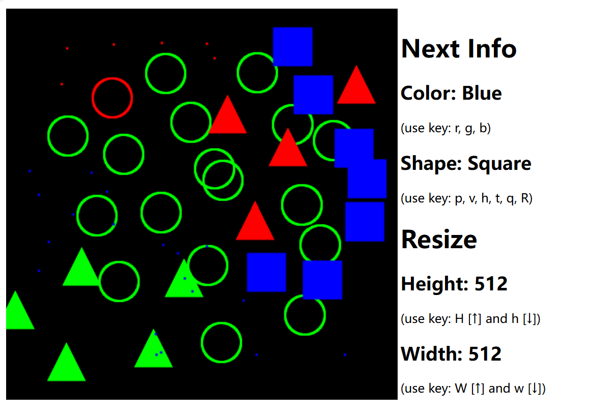

# RT_Rendering_Lab1

## Function
Draw a bunch of shapes
## Usage
### How to launch
Open main.html with your browser.
### Key specifications
Lowercase: r, g, b -> specify color of your next shape including: red, green, blue

Lowercase: p, v, h, t, q -> specify next shape including: point, vertical line, horizontal line, triangle, square

Uppercase: R -> specify next shape to a circle

uppercase: W -> increase the canvas `width`

Lowercase: w -> decrease the canvas `width`

uppercase: H -> increase the canvas `height`

Lowercase: h -> decrease the canvas `height`

Lowercase: c -> clear the canvas

